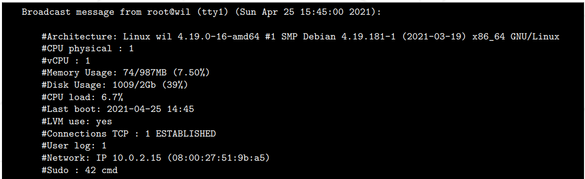
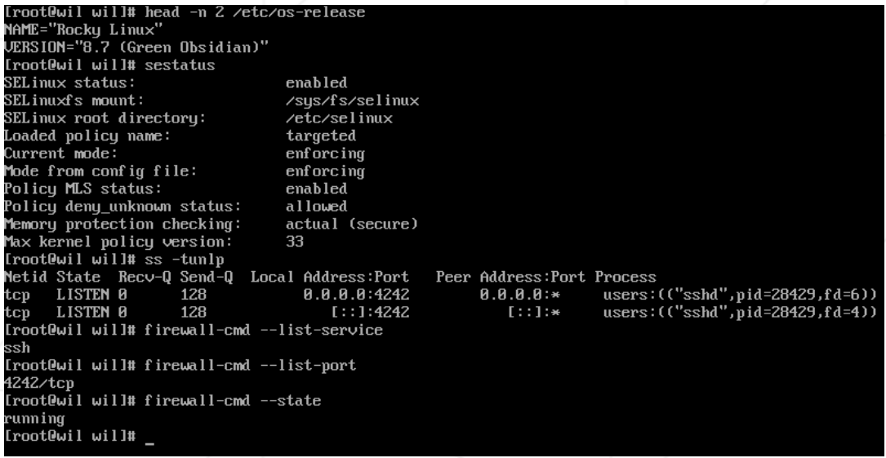
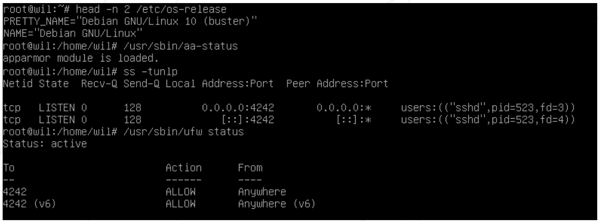
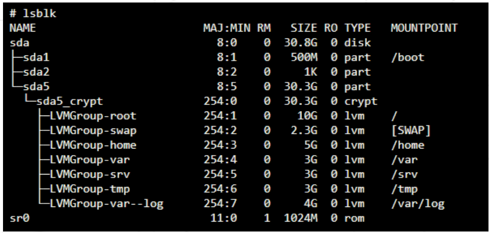

# <span style="color:;"> <center> b2b subject pdf TR</span>

Virtualization, Türkçe karşılığıyla "Sanallaştırma Teknolojisi", tek bir fiziksel bilgisayar veya sunucunun donanım kaynaklarını kullanarak birden fazla sanal makine çalıştırılmasını sağlayan bir teknolojidir ¹. Bu sayede, bilgisayarınızın performansı ve verimliliği artar, IT masrafları azalır ve bulut bilişim gibi yeni teknolojilerden faydalanabilirsiniz. <span style="color:MediumSeaGreen;">VirtualBox</span> veya <span style="color:MediumSeaGreen;">UTM</span> gibi sanallaştırma yazılımları kullanarak, belirli talimatlar doğrultusunda ilk sanal makinenizi oluşturabilirsiniz. Bu proje sonunda, kendi işletim sisteminizi kurabilir ve sıkı kurallar uygulayabilirsiniz ¹.

VirtualBox veya UTM gibi sanallaştırma yazılımlarını kullanmak zorunludur. Sadece bir signature.txt dosyası teslim etmeniz gerekiyor. Bu dosyayı, makinenizin sanal diskinin imzasını yapıştırmalısınız. Daha fazla bilgi için Teslim ve Akran Değerlendirmesi bölümüne bakın ¹.

## Zorunlu kısım

Bu proje, belirli kuralları takip ederek ilk sunucunuzu kurmanızı amaçlamaktadır.

<div style="border:2px dashed Tomato; padding: 7px; border-radius:17px">  Bir sunucu kurulumu sırasında minimum hizmetlerin yüklenmesi gereklidir. Bu nedenle, grafik arayüzü olmayacaktır. X.org veya eşdeğer grafik sunucularının yüklenmesi yasaktır. Aksi takdirde, notunuz <b>sıfır</b> (<b>0</b>) olacaktır. </div>

Seçtiğiniz işletim sisteminin en son kararlı sürümünü seçmelisiniz. Test ediliyor/kararsız bir sürüm olmamalı. Sistem yönetiminde yeniyseniz Debian şiddetle tavsiye edilir.  

<div style="border:2px dashed Purple; padding: 7px; border-radius: 17px"> Rocky’nin kurulumunun oldukça karmaşıktır. Bu nedenle, KDump kurmanız gerekli değildir ancak, SELinux başlangıçta çalışmalı ve yapılandırması projenin ihtiyaçlarına göre ayarlanmalıdır. Debian için AppArmor başlangıçta çalışmalıdır.</div>

LVM'yi kullanarak en az 2 şifrelenmiş bölüm oluşturmalısınız. Aşağıda bunun bir örneği bulunmaktadır:


<div style="border:2px dashed Purple;padding: 7px; border-radius:17px; background:; margin-bottom: px;"> Savunma sırasında size konuyla ilgili birkaç soru sorulacak.
<ul style="padding-left: px;">
 <li>Seçtiğiniz işletim sistemi.</li>
 <li>Apitude ve apt arasındaki farklar</li>
 <li>SELinux veya AppArmor'un ne olduğu </li>
</ul>
Kısacası ne kullandığınızı anlayın! </div>

Savunma sırasında SSH kullanımı yeni bir kullanıcı kurularak test edilecektir. Bu nedenle nasıl çalıştığını iyi anlamalısınız.

İşletim sisteminizi UFW (veya Rocky için firewalld) ile yapılandırmanız gerekir. Yalnızca 4242 numaralı bağlantı noktasını açık bırakabilirsiniz.

Sanal makinenizi başlattığınızda güvenlik duvarınızın aktif olması gerekir.
Rocky için UFW yerine **firewalld** kullanmanız gerekir

- Sanal makinenizin ana bilgisayar adı, 42 ile biten oturum açma bilgileriniz olmalıdır (ör.
Wil42). Değerlendirmeniz sırasında bu ana bilgisayar adını değiştirmeniz gerekecektir.
- Güçlü bir şifre politikası uygulamanız gerekir.
- **sudo**'yu katı kurallara uyarak kurmanız ve yapılandırmanız gerekir
- Kök kullanıcıya ek olarak, kullanıcı adı olarak oturum açma adınıza sahip bir kullanıcının da mevcut olması gerekir.
- Bu kullanıcının user42 ve sudo gruplarına ait olması gerekir

Savunma sırasında yeni bir kullanıcı oluşturmanız ve onu bir gruba atamanız gerekecektir.

**Güçlü bir şifre politikası oluşturmak için aşağıdaki gereksinimlere uymanız gerekir:**

- Şifrenizin süresinin her 30 günde dolmalı
- Şifre değişikleikleri arasında en az 2 gün olmalı
- Kullanıcının şifresinin geçerlilik süresi dolmadan 7 gün önce bir uyarı mesajı almalı
- Şifreniz en az 10 karakter uzunluğunda olmalıdır. 
- En az bir büyük harf, bir küçük harf ve bir sayı içermelidir.
- Ayrıca 3'ten fazla ardışık ve özdeş karakterler içermemelidir
- Şifre kullanıcının adını içermemelidir
- Şifre, önceki şifrenin bir parçası olmayan en az 7 karaktere sahip olmalıdır.
  - *Bu ifade, kök (root) şifresi için geçerli değildir*.
- Elbette root şifrenizin bu politikalara uyması gerekiyor

Sanal makinenizde yapılandırma dosyalarınızı ayarladıktan sonra, sanal makinedeki tüm hesapların, kök hesabı dahil olmak üzere şifrelerini değiştirmeniz gerekecektir  

***

**Sudo grubunuz için güçlü bir yapılandırma oluşturmak için aşağıdakilere uymanız gerekir**

- Sudo kullanarak yapılan kimlik doğrulama, yanlış parola durumunda 3 denemeyle sınırlı olmalıdır.
- Sudo kullanırken yanlış şifre nedeniyle bir hata meydana gelirse, seçtiğiniz özel bir mesajın görüntülenmesi gerekir.
- Sudo kullanan her eylemin hem giriş hem de çıkış olarak arşivlenmesi gerekir. Günlük dosyası **/var/log/sudo/** klasörüne kaydedilmelidir.
- Güvenlik nedeniyle TTY modunun etkinleştirilmesi gerekiyor
- Güvenlik nedeniyle sudo'nun kullanabileceği yollar da kısıtlanmalıdır. 
  - Örneğin: <br> /usr/local/sbin:/usr/local/bin:/usr/sbin:/usr/bin:/sbin:/bin:/snap/bin

***

Son olarak, **Monitoring.sh** adında basit bir komut dosyası oluşturmanız gerekir. Bash'ta geliştirilmesi gerekiyor.  

Sunucu başlatıldığında, komut dosyası her 10 dakikada bir tüm terminallerde bazı bilgileri (aşağıda listelenmiştir) görüntüleyecektir (duvara bir göz atın). Banner isteğe bağlıdır. Hiçbir hata görünmemelidir.

Komut dosyanız her zaman aşağıdaki bilgileri görüntüleyebilmelidir:

- İşletim sisteminizin mimarisi ve çekirdek (kernel) sürümü.
- Fiziksel işlemcilerin (processors) sayısı
- Sanal işlemcilerin sayısı
- Sunucunuzdaki mevcut kullanılabilir RAM ve yüzde olarak kullanım oranı
- Sunucunuzdaki mevcut kullanılabilir bellek ve yüzde olarak kullanım oranı
- İşlemcilerinizin yüzde olarak mevcut kullanım oranı
- Son yeniden başlatmanın tarihi ve saati
- LVM'nin aktif olup olmadığı
- Etkin bağlantıların sayısı
- Sunucuyu kullanan kullanıcı sayısı
- Sunucunuzun IPv4 adresi ve MAC (Medya Erişim Kontrolü) adresi.
- Sudo programıyla yürütülen komutların sayısı

Savunma sırasında sizden bu senaryonun nasıl çalıştığını açıklamanız istenecektir. Ayrıca, onu değiştirmeden kesmeniz gerekecektir. **Cron**'a bir göz atın

Betiğin nasıl çalışmasının beklendiğine bir örnek:



Aşağıda konunun bazı gereksinimlerini kontrol etmek için kullanabileceğiniz iki komut bulunmaktadır:

- Rocky için:

  

- Debian için:

  

## Bonus Kısım

Aşağıdakine benzer bir yapı elde etmek için bölümleri doğru şekilde ayarlayın



Aşağıdaki hizmetlerle işlevsel bir WordPress web sitesi kurun:

- lighttpd
- MariaDB
- PHP

Yararlı olduğunu düşündüğünüz bir hizmeti kurun (NGINX / Apache2 hariç !). Savunma sırasında seçiminizi gerekçelendirmeniz gerekecek.

Bonus bölümünü tamamlamak için ekstra hizmetler ayarlama olanağınız vardır. Bu durumda ihtiyaçlarınıza uygun daha fazla bağlantı noktası açabilirsiniz. Elbette UFW/Firewalld kurallarının da buna göre uyarlanması gerekiyor.

*Bonus kısmı yalnızca zorunlu kısmın MÜKEMMEL olması durumunda değerlendirilecektir. Mükemmel, zorunlu olan kısmın bütünleşik olarak yapılmış olduğu ve arızalanmadan çalıştığı anlamına gelir. TÜM zorunlu şartları geçemediyseniz, bonus bölümünüz hiçbir şekilde değerlendirilmeyecektir.*

## Gönderim ve akran değerlendirmesi

Git deposunuzun kökünde bir signature.txt dosyası teslim etmeniz yeterlidir. Sanal disk imzanızı yapıştırmanız gerekiyor. Bu imzayı almak için önce varsayılan kurulum klasörünü açmanız gerekiyor (bu, sanal makinelerinizin kaydedildiği klasördür)

```Shell
Windows: %HOMEDRIVE%%HOMEPATH%\VirtualBox VMs\
Linux: ~/VirtualBox VMs/
MacM1: ~/Library/Containers/com.utmapp.UTM/Data/Documents/
MacOS: ~/VirtualBox VMs/
```

Sanal makinenizin “.vdi” dosyasından (veya UTM kullanıcıları için “.qcow2”) sanal makinenizin imzasını sha1 formatında almanız gerekiyor. Aşağıda rocky_serv.vdi dosyası için 4 komut örneği verilmiştir:

```Shell
Windows: certUtil -hashfile rocky_serv.vdi sha1
Linux: sha1sum rocky_serv.vdi
For Mac M1: shasum rocky.utm/Images/disk-0.qcow2
MacOS: shasum rocky_serv.vdi
```

Alacağınız çıktı örneği: <br>
``6e657c4619944be17df3c31faa030c25e43e40af``  

İlk değerlendirmenizden sonra sanal makinenizin imzasının değişebileceğini lütfen unutmayın. Bu sorunu çözmek için sanal makinenizi çoğaltabilir veya kaydetme durumunu kullanabilirsiniz.

Git deponuzdaki sanal makinenizi açmanız elbette YASAKTIR. Savunma sırasında imza.txt dosyasının imzası sanal makinenizin imzasıyla karşılaştırılacaktır. İkisi aynı değilse notunuz **sıfır** (**0**) olacaktır.