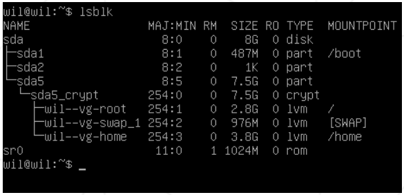

#  
 b2b pdf 

Virtualization, Türkçe karşılığıyla "Sanallaştırma Teknolojisi", tek bir fiziksel bilgisayar veya sunucunun donanım kaynaklarını kullanarak birden fazla sanal makine çalıştırılmasını sağlayan bir teknolojidir ¹. Bu sayede, bilgisayarınızın performansı ve verimliliği artar, IT masrafları azalır ve bulut bilişim gibi yeni teknolojilerden faydalanabilirsiniz. VirtualBox veya UTM gibi sanallaştırma yazılımları kullanarak, belirli talimatlar doğrultusunda ilk sanal makinenizi oluşturabilirsiniz. Bu proje sonunda, kendi işletim sisteminizi kurabilir ve sıkı kurallar uygulayabilirsiniz ¹.

VirtualBox veya UTM gibi sanallaştırma yazılımlarını kullanmak zorunludur. Sadece bir signature.txt dosyası teslim etmeniz gerekiyor. Bu dosyayı, makinenizin sanal diskinin imzasını yapıştırmalısınız. Daha fazla bilgi için Teslim ve Akran Değerlendirmesi bölümüne bakın ¹.
 ## Mandatory

Bu proje, belirli kuralları takip ederek ilk sunucunuzu kurmanızı amaçlamaktadır.

  Bir sunucu kurulumu sırasında minimum hizmetlerin yüklenmesi gereklidir. Bu nedenle, grafik arayüzü olmayacaktır. X.org veya eşdeğer grafik sunucularının yüklenmesi yasaktır. Aksi takdirde, notunuz <b>sıfır</b> (<b>0</b>) olacaktır. 

Seçtiğiniz işletim sisteminin en son kararlı sürümünü seçmelisiniz. Test ediliyor/kararsız bir sürüm olmamalı. Sistem yönetiminde yeniyseniz Debian şiddetle tavsiye edilir.  

 Rocky’nin kurulumunun oldukça karmaşıktır. Bu nedenle, KDump kurmanız gerekli değildir ancak, SELinux başlangıçta çalışmalı ve yapılandırması projenin ihtiyaçlarına göre ayarlanmalıdır. Debian için AppArmor başlangıçta çalışmalıdır.

LVM'yi kullanarak en az 2 şifrelenmiş bölüm oluşturmalısınız. Aşağıda bunun bir örneği bulunmaktadır:

 Savunma sırasında size konuyla ilgili birkaç soru sorulacak. 
<ul style="padding-left: px;">
	<li>Seçtiğiniz işletim sistemi.</li>
	<li>Apitude ve apt arasındaki farklar</li>
	<li>SELinux veya AppArmor'un ne olduğu </li>
</ul>
Kısacası ne kullandığınızı anlayın! 
